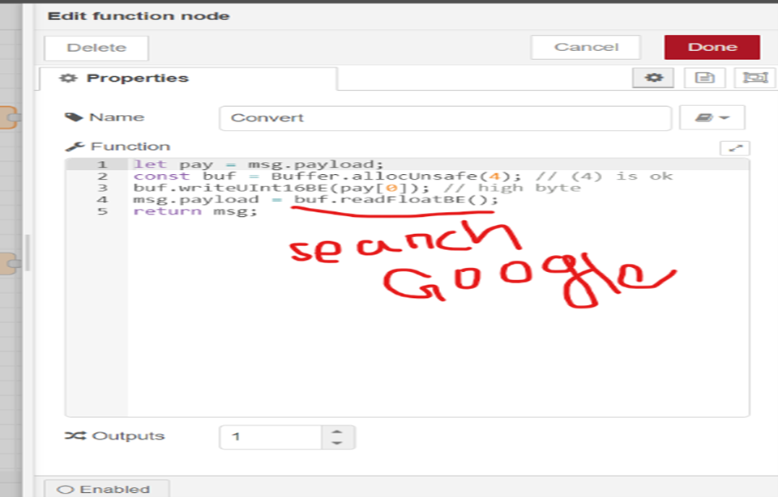

# READ-TST300V2-TEMP.-and-HUMI.-sensors-data-read-using-Modbus-Master-Simulation
Read TST300 V2 temperature and humidity sensor data read using Modbus Master simulation and 
sending those data to Ubidots.

1.Read Temperature sensor data:

	At beginning we must identify which port we will use in our laptop. Then, we need to go in my devices application server to figure out this. 

	Download Modbus master simulation below links,

	For reading data from devices, at first, we must setup device settings by simulation.

	Device ID:1, Holding resister, Address-100, Length-2

2.Humedity sensor data read:

	Setup device settings 

	Device ID:3, Holding resister, Address-102, Length-2

3.Read data from meter:

	Setup device settings:

	Device ID:2, Input Resister, Address-0, Length-1

4.Modbus RTU setting:

	Port- COM5

	Bitrate-19200

	Parity-Even

	Stop Bit-1

5.Those data send to Node-red: Temperature sensor RTU settings:

6.Meter data read by node-red:

	Set function node:

7.Those data send to Node-red: Humidity sensor:

8.Simens IOT2040 Connection:

	Open the IoT2040 then remove memory card.

	Flash the memory card by SD card format with PC.

	Download the IOT-2040 Image from SIEMENSE web site. To download image, we need to open an account and login to this site.

	After that IOT-2040 image install our memory card using BalenaEatcher application.

	Now set everything.

	Then we connect IoT2040 by putty. It has default IP-192.168.200.1

Login-root

Password-passwd.

	Type (iot2000setup) for entry the device.

	Both computer IP and device IP will be same otherwise putty will not be able for communication.

Enter the software to active Node-red. If IoT connected with our Computer, then we can use default IP-192.168.200.1 for login Node-red. If we don’t change it.

	If our IoT connect with our router by port-eth1, then it will take a different IP. That time we must use different IP for login Node-red.

	For this we can login our router then search (sub mask number) which provide Simians on this device.

For more information:

https://help.ubidots.com/en/articles/1410250-connect-a-siemens-simatic-iot2000-to-ubidots-over-mqtt-using-nodered

https://help.ubidots.com/en/articles/1440402-connect-node-red-with-ubidots

9.Login Node-red using brower:

Node red flow to connect and sending data to Ubidots,

Settings Ubidots node,

Settings MQTT node,

Setting function node,

🚩 Connect with me on social
- LinkedIn: https://www.linkedin.com/in/ariful-islam-arif-2987b51a3/
- Twitter: https://twitter.com/arifulislam301
- Instagram: https://www.instagram.com/ariful_mr_islam/

🔔 Subscribe to my YouTube channel
https://www.youtube.com/channel/UCED68cm6nHaAlAk0h9I3yAQ

